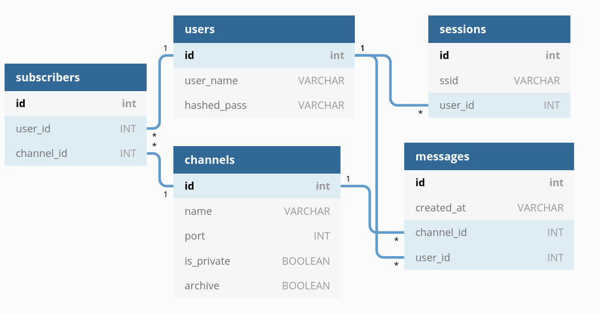

# Datcord README.md

Datcord is an app for building communities around common interests. Our topic-based channels make it easy to collaborate, share, and chat with others.

# Code Stack:

Datcord is built on a Node/Express/PostgreSQL backend with a React front end.

# Setup & Running Code

- [ ] `npm install` installs all dependencies in the pacakge.json folder
- [ ] `npm run dev` runs development environment at http://localhost/8080 with a server proxy at http://localhost/3000
- [ ] `npm run build` creates build.js in a build folder
- [ ] `npm run start` can be run after npm run build

# Testing the Code

- [ ] `npm run testserver` runs the backend server at http://localhost/3000, with the use of a database specific to testing
- [ ] `npm run test` runs the existing test cases - must be run after "npm run testserver"

# Database tables & Environment variables

Create your own database and store `PG_URI_DEV = 'your-pg-uri'` in an .env file. See .env.example for guidance.

The following SQL queries can be used to create each table in the database:
```
CREATE TABLE users(id SERIAL PRIMARY KEY, user_name VARCHAR UNIQUE NOT NULL, hashed_pass VARCHAR NOT NULL);
CREATE TABLE sessions(id SERIAL PRIMARY KEY, ssid VARCHAR, user_id INT REFERENCES users(id));
CREATE TABLE channels(id SERIAL PRIMARY KEY, name VARCHAR, port INT, is_private BOOLEAN, archive BOOLEAN);
CREATE TABLE subscribers(id SERIAL PRIMARY KEY, user_id INT REFERENCES users(id), channel_id INT REFERENCES channels(id));
CREATE TABLE messages(id SERIAL PRIMARY KEY, created_at VARCHAR, channel_id INT REFERENCES channels(id), user_id INT REFERENCES users(id));
```


For testing purposes, a second database should be created with the same tables. Once the testing database is created, store `PG_URI_TEST = 'your-pg-test-uri'` in the same .env file that you created before.

# Routes for client/server communication


| Route  | Request Type   | Request body   | Response body  | Description / Notes   |
|---|---|---|---|---|
| '/'  | GET | n/a   | Serve client index file  |   |
| '/api/login'  | POST  | *Body* {username: 'string', password: 'string'}  | *Body* { isLoggedIn: 'boolean', username: 'string', *optional* errorMsg: 'string' }  | *Note* Status of 500 indicates that an error occured, and an errorMsg is attached  |
| '/api/signup'  | POST  | *Body*  {username: 'string', password: 'string'}  | *Body* { isLoggedIn: 'boolean', username: 'string', *optional* errorMsg: 'string' }  | *Note* Status of 500 indicates that an error occured, and an errorMsg is attached. The passwords are encrypted using bcrypt before adding to database.   |
| '/api/isloggedin'  | GET  | N/A  | *Body* { isLoggedIn: 'boolean', username: 'string', *optional* errorMsg: 'string' } |  Status of 500 indicates that an error occured, and an errorMsg is attached. Route will check the request header for an SSID cookie, and check any attached SSID cookies against to the sessions database to determine its validity, and the associated user |

# Components and State

TO DO


# Fixes, features, and overhauls 

*These are things we haven't implemented yet but would love to see*

1. Fixes and Potential improvements
- [ ] TO DO

2. Features
- [ ] TO DO

3. Overhauls
- [ ] TO DO
